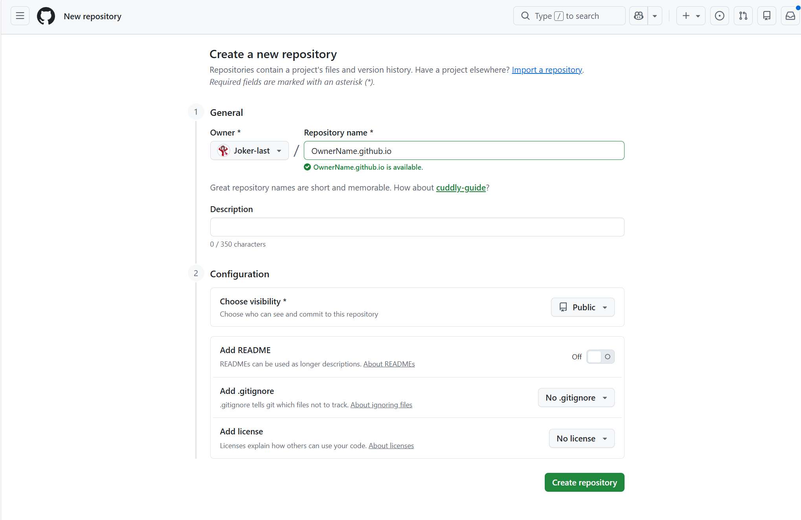

- [博客类型](#博客类型)
  - [静态博客](#静态博客)
  - [动态博客](#动态博客)
- [准备事项](#准备事项)
  - [主机](#主机)
  - [程序](#程序)
  - [域名](#域名)
  - [模版](#模版)
- [案例演示](#案例演示)
  - [部署开源博客模版框架](#部署开源博客模版框架)
  - [新建GitHub仓库](#新建GitHub仓库)
  - [使用Git上传](#使用Git上传)

## 博客类型 

### 静态博客

#### 优点

- 静态博客可以做到绝对安全
- 静态博客及其轻量
- 拥有完整数字资产的所属权
- 静态博客由于是直接返回 HTML，可以通过全球 CDN 加速做到非常快的站点响应速度
- SEO 支持度高

#### 缺点

- 无原生动态功能
- 内容更新流程繁琐
- 缺乏后台管理界面（CMS）
- 动态交互受限
- 构建与部署的隐性成本
- 内容量大了之后的性能瓶颈
- 协作与多用户支持弱
- 有一定的技术门槛和对动手能力的需求

### 动态博客


#### 优点

- 功能丰富
- 可以和数据库交互，可以使用相关的 API，丰富自己的站点
- 具有可玩性，复杂度、可扩展性高

#### 缺点

- 自己需要相关的知识储备
- 对服务器等其他资源有要求
- 安全风险高
- 维护与更新负担重
- 部署与扩展复杂

## 准备事项

### 主机

- 动态博客必须购买/租用服务器（VPS、云主机、虚拟主机），需 24h 运行
- 静态博客不必须买服务器，可用 GitHub Pages / Vercel / Netlify / Cloudflare Pages 等免费托管

### 程序

- 动态博客必须安装运行时程序（WordPress、Typecho、Ghost、Halo 等）	
- 静态博客必须安装构建程序（Hexo、Hugo、Astro、Jekyll 等），本地生成 HTML 后上传

### 域名

- 两者都不是绝对必须，但正式使用都建议购买独立域名

### 模版

- 动态博客必须有主题，程序自带默认主题，也可安装第三方主题
- 静态博客必须有主题，生成器自带默认主题，也可安装第三方主题
- 两者都有主题生态，但技术栈不同（PHP vs 模板引擎）


## 案例演示

以本静态博客的部署过程为例子

### 部署开源博客模版框架

首先在bilibili、GitHub等资源网站上找到自己心仪的开源博客模版框架，根据教程拉取到本地，我这里使用的是b站Up主松坂有希提供的Mizuki模版，视频如下：<div style="position: relative; padding-bottom: 56.25%; height: 0; overflow: hidden; border-radius: 8px;">
  <iframe 
    src="//player.bilibili.com/player.html?isOutside=true&aid=11502299990635658&bvid=BV1aZbezkE7s&cid=31677415531&p=1" 
    style="position: absolute; top: 0; left: 0; width: 100%; height: 100%;" 
    scrolling="no" 
    border="0" 
    frameborder="no" 
    framespacing="0" 
    allowfullscreen="true">
  </iframe>
</div>
视频简介如下：

前段时间从Hexo迁移到了基于Astro的Fuwari主题，发现功能无法满足我的需求，于是就自己动手重构了一个新的主题——**Mizuki**，喜欢的可以给项目 Star 一下！

- **项目文档**：[https://docs.mizuki.mysql.com](https://docs.mizuki.mysql.com)
- **GitHub 开源地址**：[https://github.com/matsuzaka-yuki/Mizuki](https://github.com/matsuzaka-yuki/Mizuki)
- **Gitee 开源地址**：[https://gitee.com/matsuzakayuki/Mizuki](https://gitee.com/matsuzakayuki/Mizuki)
- **Astro 官网主题页**：[https://astro.build/themes/details/mizuki/](https://astro.build/themes/details/mizuki/)
- **交流群**：1007524064


**使用前必看**


在开始使用Mizuki主题之前，需要确保系统满足以下要求：

Node.js>=20  
pnpm>=9  
Git  

环境准备好了之后,在本地来部署Mizuki  
克隆Mizuki项目到本地(在要存放的位置新建文件夹，并在文件夹中打开git)
```
git clone https://github.com/matsuzaka-yuki/mizuki.git
```
然后cd到当前目录
```
cd Mizuki
```
下一步使用pnpm安装项目依赖：
```
pnpm install
```
在启动项目之前，您需要根据自己的需求进行配置，编辑src/config.ts文件来自定义博客设置，更新站点信息、主题颜色、横幅图片和社交链接等等配置

运行以下命令启动开发服务器
```
pnpm dev
```
完成后可在浏览器访问给出的本地端口地址查看你的博客

运行以下代码将网站打包成静态文件，会生成并保存在dist目录里
```
pnpm build
```
生成的dist目录可以部署到您自己的服务器上，也可以放置在github或者vercel，虚拟主机也可以

由于该项目是静态博客，无后端的，无需数据库，纯前端项目，所以需要手动编辑配置文件
### 新建GitHub仓库

如下图所示，利用GitHub Pages免费部署博客，仓库名需要强制（你的GitHub账户）用户名.github.io（个人主页，永久主站）


### 使用Git上传
```
# 进入打包后的静态文件夹
cd public
# 初始化git
git init
git add .
git commit -m "deploy blog static"
# 关联远程仓库，替换为你的仓库地址
git remote add origin https://github.com/用户名/仓库名.git
# 强制推送到 gh-pages 分支
git push -f origin HEAD:gh-pages
```

开启 GitHub Pages  

1.打开仓库 → Settings → 找到 Pages  
2.Source 选择 Deploy from a branch  
3.Branch 选 gh-pages，文件夹选 / (root)  
4.保存，等待 1-5 分钟即可访问